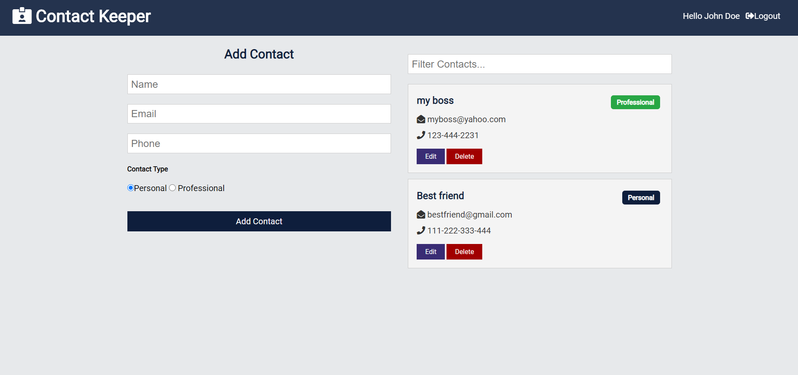

# Contact-Keeper
## Full stack web app

### what can you do?
The user can register, add his own contacts, edit, delete and filter them.

### Frontend:
- React with hooks.
- Context API.

### backend:
- Nodejs with Express
- Bcryptjs
- JWT
- MongoDB.

